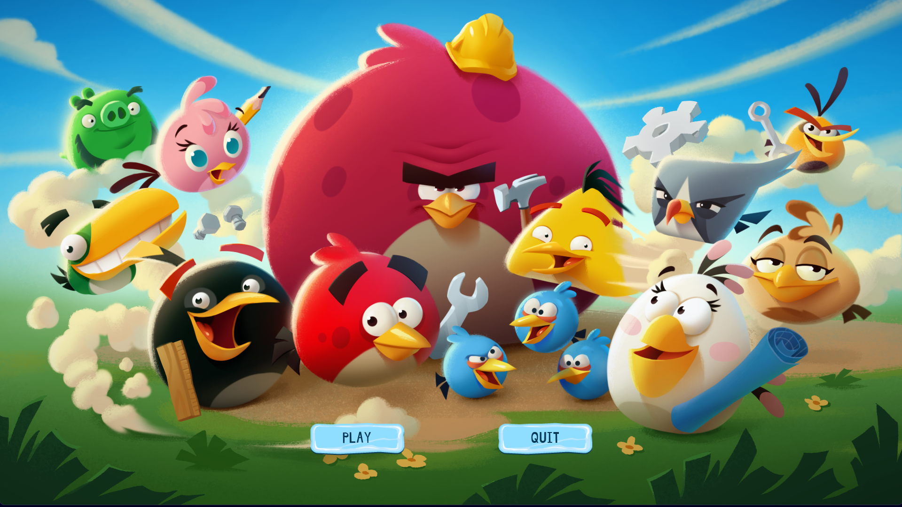
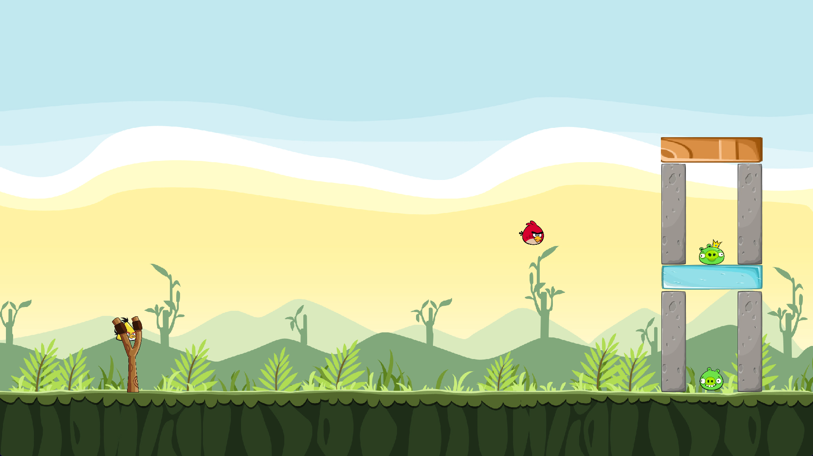

# Angry Birds Clone

<div align="center">

A feature-rich, physics-based Angry Birds clone built in Java using the **libGDX** framework and **Box2D** physics engine. Launch birds, destroy structures, and defeat all the pigs across 3 handcrafted levels — complete with special bird abilities, game saving, and multiple game screens.

[](https://www.java.com/)
[](https://libgdx.com/)
[](https://box2d.org/)
[](LICENSE)
[](https://gradle.org/)

</div>

---

## Screenshots

| Start Screen | Gameplay |
|:---:|:---:|
|  |  |

---

## 🎮 Features

### Core Gameplay
- **Slingshot Mechanic** — Click and drag to aim; release to launch. A dotted trajectory preview helps you plan your shot.
- **Physics Simulation** — Powered by Box2D with realistic gravity (`-9.8 m/s²`), collision detection, and impulse-based forces.
- **Destructible Structures** — Blocks sustain damage on collision and are removed from the world when their health reaches zero.
- **Enemy Pigs** — Three types of pigs with varying health pools protect the structures. Destroy them all to win the level.

### Bird Roster & Special Abilities
| Bird | Name | Special Ability (`SPACE`) |
|:----:|:-----|:--------------------------|
| 🔴 | **Red Bird** | No special ability — reliable and sturdy |
| 🔴 | **Big Red Bird** | Larger and heavier variant of Red |
| 🟡 | **Yellow Bird** | Activates a **speed boost** in the current direction of travel |
| 🔵 | **Blue Bird** | Splits into **3 smaller birds** mid-air with slight random offsets and spin |
| ⚫ | **Black Bird** | Triggers a massive **area explosion** dealing damage to all nearby objects |

### Enemy Types
| Pig | Name | Health |
|:----|:-----|:------:|
| 🐷 | **Minion Pig** | 100 HP |
| 👷 | **Foreman Pig** | 300 HP |
| 👑 | **King Pig** | 600 HP |

### Block Materials
| Block | Material | Health |
|:------|:---------|:------:|
| 🔷 | **Glass** | 200 HP |
| 🪵 | **Wood** | 800 HP |
| 🪨 | **Stone** | 500 HP |

> Blocks can be placed **horizontally or vertically** — the game automatically rotates them based on their width vs. height dimensions.

### Game Screens & Navigation
| Screen | Description |
|:-------|:------------|
| **Main Menu** | Entry point with navigation to New Game / Load Game |
| **Game Save Screen** | Choose between starting a new game or loading a previously saved state |
| **Level Selection** | Pick from 3 available levels |
| **Playing Screen** | Main game viewport with the active level rendered in real-time |
| **Pause Menu** | Accessible via `ESC` — Resume, Restart, Save & Quit, Level Select, Main Menu |
| **Winning Screen** | Displayed when all pigs are defeated |
| **Losing Screen** | Displayed when all birds are exhausted and pigs still remain |

### Save & Load System
- Game progress is serialized to `.ser` files (`level_1.ser`, `level_2.ser`, `level_3.ser`) using Java's `ObjectOutputStream`.
- The saved state captures: **bird positions**, **pig positions**, **block positions**, **health values**, **linear velocities**, **angular velocities**, and the **current bird index**.
- Resume a previously saved game right from where you left off.

---

## Controls

| Action | Input |
|:-------|:------|
| Aim Bird | Click & drag near the slingshot |
| Launch Bird | Release mouse button |
| Use Special Ability | `SPACE` (while the bird is in flight) |
| Pause / Unpause | `ESC` |

---

## Getting Started

### Prerequisites

- **Java 11** or higher ([Download JDK](https://adoptium.net/))
- **Git** (to clone the repository)

### Option 1 — Run the Pre-built JAR (Recommended)

Download the latest release `.jar` from the [Releases page](https://github.com/MAHanupriSAR/Angry_Birds/releases) and run:

```bash
java -jar angry_bird-1.0.0.jar
```

> The JAR is a self-contained fat/uber JAR — all dependencies are bundled. No additional setup required.

### Option 2 — Build from Source

**1. Clone the repository**

```bash
git clone https://github.com/MAHanupriSAR/Angry_Birds.git
cd Angry_Birds
```

**2. Run the game directly**

```bash
# On Linux/macOS
./gradlew lwjgl3:run

# On Windows
gradlew.bat lwjgl3:run
```

**3. Build an executable JAR**

```bash
# On Linux/macOS
./gradlew lwjgl3:jar

# On Windows
gradlew.bat lwjgl3:jar
```

The built JAR will be placed at:
```
lwjgl3/build/libs/angry_bird-1.0.0.jar
```

---

## Project Structure

```
Angry_Birds/
├── core/                              # Main game logic (platform-independent)
│   └── src/main/java/angry_bird/
│       ├── main/
│       │   └── Main.java              # Application entry point (extends libGDX Game)
│       ├── Levels/
│       │   ├── Level.java             # Base level class (world setup, rendering, win/loss logic)
│       │   ├── Level1.java            # Level 1 definition (loads level/level1.tmx)
│       │   ├── Level2.java            # Level 2 definition (loads level/level2.tmx)
│       │   ├── Level3.java            # Level 3 definition (loads level/level3.tmx)
│       │   └── LevelManager.java      # Manages the active level & transitions
│       ├── gameObjects/
│       │   ├── GameObject.java        # Abstract base for all physics objects
│       │   ├── Background.java        # Static ground/terrain body
│       │   ├── SlingShot.java         # Input handling, trajectory preview, bird launch logic
│       │   ├── birds/
│       │   │   ├── Bird.java          # Abstract Bird base class
│       │   │   ├── Red.java           # Red bird (no ability)
│       │   │   ├── BigRed.java        # Big Red bird (larger variant)
│       │   │   ├── Yellow.java        # Yellow bird (speed boost)
│       │   │   ├── Blue.java          # Blue bird (triple split with random spin)
│       │   │   └── Black.java         # Black bird (area explosion)
│       │   ├── blocks/
│       │   │   ├── Block.java         # Abstract Block base class
│       │   │   ├── Glass.java         # Glass block (200 HP)
│       │   │   ├── Wood.java          # Wood block (800 HP)
│       │   │   └── Stone.java         # Stone block (500 HP)
│       │   └── pigs/
│       │       ├── Pig.java           # Abstract Pig base class
│       │       ├── MinionPig.java     # Minion Pig (100 HP)
│       │       ├── ForemanPig.java    # Foreman Pig (300 HP)
│       │       └── KingPig.java       # King Pig (600 HP)
│       ├── gamescreens/
│       │   ├── MainMenuScreen.java    # Main menu
│       │   ├── GamesaveScreen.java    # New Game / Load Game selection
│       │   ├── LevelSelectionScreen.java
│       │   ├── PlayingScreen.java     # Active gameplay screen
│       │   ├── PauseMenu.java         # In-game pause overlay
│       │   ├── WinningScreen.java     # Win state screen
│       │   └── LoosingScreen.java     # Lose state screen
│       ├── serializable/
│       │   ├── LevelState.java        # Serializes/deserializes the full level snapshot
│       │   └── GameObjectState.java   # Per-object snapshot (position, velocity, health)
│       └── utils/
│           ├── Constants.java         # Centralized constants (HP values, asset paths, skin paths)
│           ├── GameContactListener.java # Box2D collision event handler (damage logic)
│           └── HelperMethods.java     # Shared utility methods
├── lwjgl3/                            # Desktop launcher (LWJGL3 backend)
│   └── build.gradle                   # Fat JAR build config, cross-platform native targets
├── assets/                            # All game assets
│   ├── game_objects/
│   │   ├── birds/                     # Bird sprites (red, big_red, yellow, blue, black, matilda)
│   │   ├── blocks/                    # Block sprites (glass, wood, stone)
│   │   ├── pigs/                      # Pig sprites
│   │   └── slingshot.png
│   ├── level/                         # Tiled map (.tmx) files for each level
│   ├── screens/                       # Background images for all game screens
│   ├── skins/                         # UI skins (Metal, Freezing, Comic)
│   ├── level_1.ser                    # Serialized save state for Level 1
│   ├── level_2.ser                    # Serialized save state for Level 2
│   └── level_3.ser                    # Serialized save state for Level 3
├── screenshots/                       # README screenshots
│   ├── start_screen.png
│   └── gameplay.png
├── build.gradle                       # Root Gradle build file
├── gradle.properties                  # Version config (gdxVersion=1.12.1, projectVersion=1.0.0)
└── settings.gradle                    # Gradle subproject settings (core, lwjgl3)
```

---

## Architecture & Technical Details

### Physics Engine — Box2D
- The game world runs a **Box2D** simulation with gravity `(0, -9.8)`.
- All game objects (birds, pigs, blocks, ground) are backed by **rigid bodies** with defined fixtures.
- `GameContactListener` (implements `ContactListener`) handles collision callbacks to deal proportional damage when bodies impact.
- The world is stepped at **60 FPS** (`dt = 1/60f`, 6 velocity iterations, 2 position iterations).

### Level Loading — Tiled Maps
- Levels are authored in the **Tiled Map Editor** (`.tmx` format) and loaded via libGDX's `TmxMapLoader`.
- Object layers in the `.tmx` file define game entity type and placement:

| Layer | Entities |
|:------|:---------|
| `ground` | Static terrain body |
| `birdsLayer` | Bird queue (`red`, `yellow`, `blue`, `black`, `bigred`) |
| `pigsLayer` | Enemy pig placements (`minion`, `foreman`, `king`) |
| `blocksLayer` | Block structures (`stone`, `wood`, `glass`) |

### Serialization — Save System
- `LevelState` implements `java.io.Serializable` and captures a complete snapshot of the game.
- Uses `ObjectOutputStream` / `ObjectInputStream` for binary serialization to `.ser` files.
- `GameObjectState` stores: `(x, y)` position, rotation angle, linear velocity (`Vector2`), angular velocity, and health for every entity.

### UI — libGDX Scene2D
- All menus are built with libGDX's **Scene2D** UI system (`Stage`, `Table`, `TextButton`).
- The active UI skin is **Freezing UI** (from [`gdx-skins`](https://github.com/czyzby/gdx-skins)).
- Three skins are bundled and switchable via `Constants.java`: **Metal**, **Freezing**, and **Comic**.

### Slingshot Mechanic & Trajectory Preview
- Mouse/touch input is handled by `SlingShotInputProcessor` (extends `InputAdapter`).
- Drag is **clamped to a max radius of 2.0 units** in Box2D world space to ensure fair launches.
- A **dotted trajectory preview** is drawn via `ShapeRenderer` during the drag phase using the kinematic equations:
  - `x(t) = x₀ + vₓ·t`
  - `y(t) = y₀ + vy·t + ½·g·t²`
- Launch impulse is scaled by `STRENGTH = 10f`.

---

## Dependencies

| Dependency | Version | Purpose |
|:-----------|:--------|:--------|
| `libGDX` | `1.12.1` | Core cross-platform game framework |
| `gdx-backend-lwjgl3` | `1.12.1` | Desktop (LWJGL3) backend |
| `gdx-box2d` + `natives` | `1.12.1` | 2D rigid body physics engine |
| `gdx-controllers` | `2.2.3` | Gamepad/controller input support |
| `gdx-bullet` + `natives` | `1.12.1` | 3D physics (bundled) |
| `gdx-freetype` + `natives` | `1.12.1` | TrueType font rendering |
| `ashley` | `1.7.4` | Entity-Component-System framework (bundled) |
| `box2dlights` | `1.5` | Dynamic Box2D lighting (bundled) |
| `ai` | `1.8.2` | AI / pathfinding utilities (bundled) |

---

## [Releases](https://github.com/MAHanupriSAR/Angry_Birds/releases)

Check out the Releases page for the latest pre-built `.jar` downloads.

---

## Asset Credits

| Asset | Source |
|:------|:-------|
| **Metal UI Skin** | [Skin Composer by raeleus](https://github.com/raeleus/skin-composer) |
| **Frozen UI Skin** | [gdx-skins by czyzby](https://github.com/czyzby/gdx-skins) |
| **Comic UI Skin** | [gdx-skins by czyzby](https://github.com/czyzby/gdx-skins) |

---

## License

This project is licensed under the terms of the [MIT License](LICENSE).

---

## Credits & Acknowledgements

- Built with [libGDX](https://libgdx.com/) — the cross-platform Java game development framework.
- Physics powered by [Box2D](https://box2d.org/).
- Levels designed using [Tiled Map Editor](https://www.mapeditor.org/).
- Inspired by the original [Angry Birds](https://www.rovio.com/games/angry-birds/) by Rovio Entertainment.
